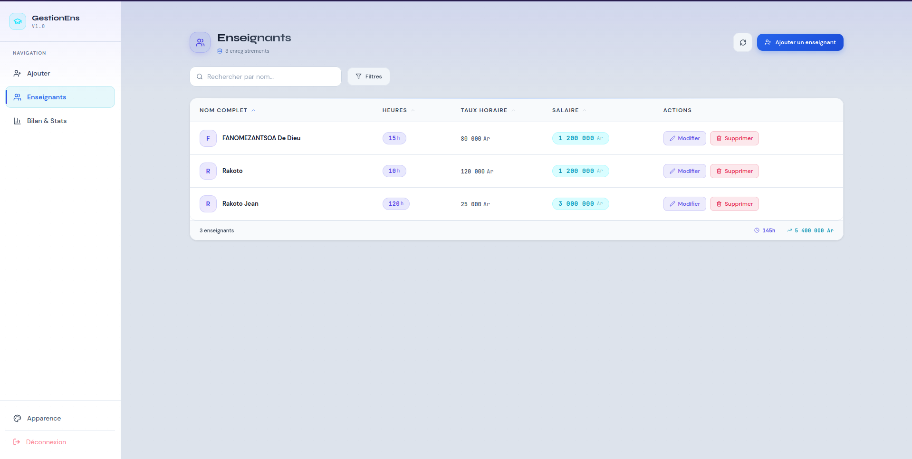
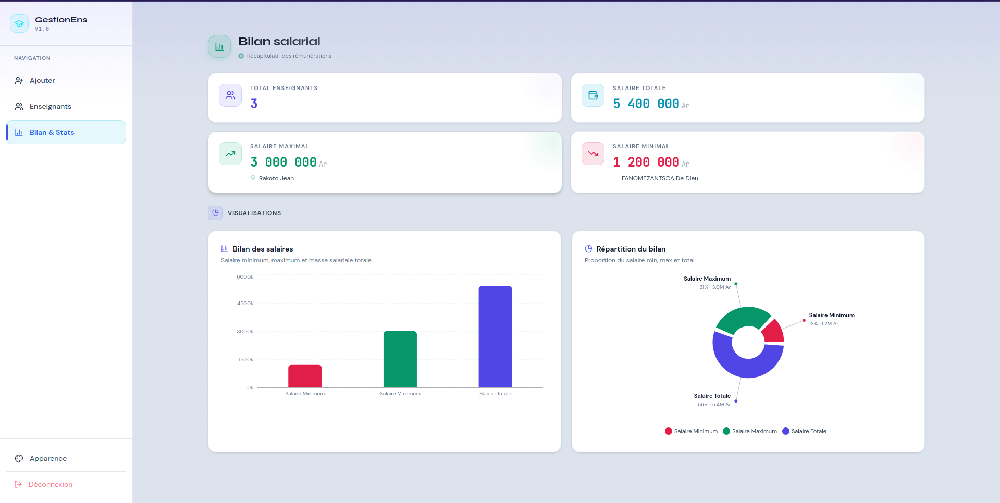

# GestionEns

Application web de gestion des enseignants avec calcul automatique des salaires.

## Aperçu

GestionEns permet de gérer les informations des enseignants à travers une interface moderne et intuitive. L'application intègre un tableau de bord statistique, des opérations CRUD complètes et des outils d'analyse des données.

## Fonctionnalités

* Authentification sécurisée
* Tableau de bord statistique
* Gestion des enseignants
* Recherche et filtrage
* Calcul automatique des salaires
* Visualisation des données
* Interface responsive

## Technologies

### Frontend

* React
* Vite
* Tailwind CSS
* Axios
* Recharts

### Backend

* PHP
* API REST
* MySQL
* JWT

## Structure du projet

```text
gestion-enseignants/
├── frontend/
├── backend/
└── database/
```

## Installation

### Backend

```bash
cd backend
php -S localhost:8000
```

### Frontend

```bash
cd frontend
npm install
npm run dev
```

## Fonctionnement

Le salaire d'un enseignant est calculé automatiquement à partir du nombre d'heures effectuées et du taux horaire défini.

## Modules principaux

* Authentification
* Gestion des enseignants
* Statistiques et rapports

## Gestion des enseignants


## Gestion des enseignants


##Statistiques et rapports



## Auteur

Projet réalisé dans le cadre de l'apprentissage du développement web full-stack avec React, PHP et MySQL.

